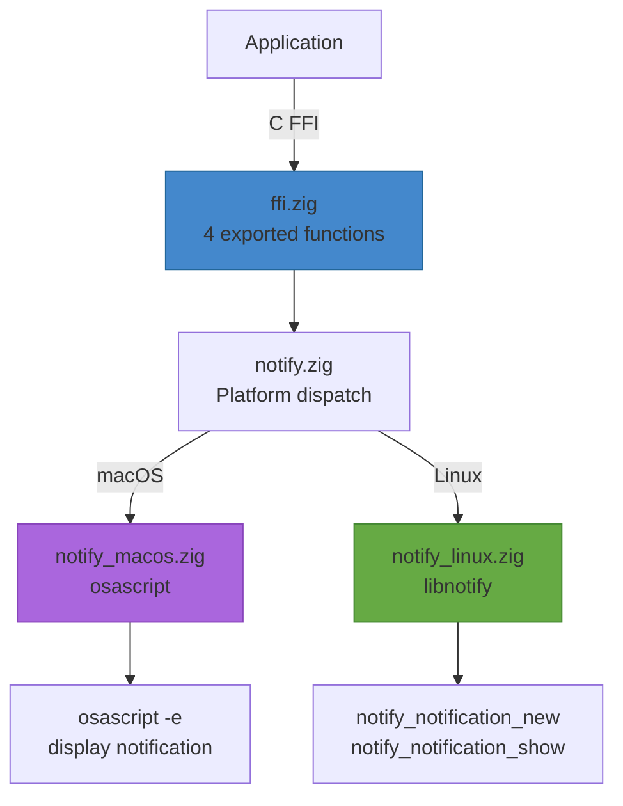

# zig-notify

Cross-platform notification abstraction in Zig with C FFI -- macOS (osascript) and Linux (libnotify).

**License:** Zlib OR MIT

## Why

Desktop notifications have completely different APIs on macOS (UNUserNotificationCenter or osascript) and Linux (libnotify/D-Bus). This library provides a single C API that works on both platforms, with urgency level support and proper lifecycle management.

## Features

- **Send notifications**: Title, body, and urgency level
- **Permission handling**: Request notification permission (macOS), no-op on Linux
- **Lifecycle**: Init/deinit for proper resource management (Linux)
- **C FFI**: 4 exported functions callable from Swift, C, C++, or any language with C interop
- **macOS**: osascript (AppleScript `display notification`)
- **Linux**: libnotify (GLib notification API)

## Installation

### Zig Package Manager (recommended)

```bash
zig fetch --save git+https://github.com/Jesssullivan/zig-notify.git
```

Then in your `build.zig`:

```zig
const dep = b.dependency("zig-notify", .{ .target = target, .optimize = optimize });
exe.root_module.addImport("zig-notify", dep.module("zig-notify"));
```

### Git Submodule (C FFI consumers)

```bash
git submodule add https://github.com/Jesssullivan/zig-notify.git vendor/notify
cd vendor/notify && zig build -Doptimize=ReleaseFast
```

Link (macOS): `-lzig-notify` (no frameworks; uses osascript binary).
Link (Linux): `-lzig-notify -lnotify -lglib-2.0 -lgobject-2.0`.
Include: `#include "zig_notify.h"`.

## Requirements

- Zig 0.14.1+
- macOS 13+ or Linux (libnotify)

## Architecture



## Build

```bash
# Static library (libzig-notify.a)
zig build -Doptimize=ReleaseFast

# Run unit tests
zig build test
```

With Nix:

```bash
nix develop       # dev shell
nix build         # build library package
```

## Platform Support

| Platform | Backend | Packages | Status |
|----------|---------|----------|--------|
| macOS 13+ (arm64/x86_64) | osascript (AppleScript) | None | Tested |
| Linux (x86_64/arm64) | libnotify (GLib) | `libnotify-dev` (apt) / `libnotify-devel` (dnf) | Supported |
| Cross-compilation | -- | Libs linked at final build | Supported |

## C FFI API Reference

Header: [`include/zig_notify.h`](include/zig_notify.h)

### Types

```c
typedef enum {
    ZIG_NOTIFY_URGENCY_LOW = 0,
    ZIG_NOTIFY_URGENCY_NORMAL = 1,
    ZIG_NOTIFY_URGENCY_CRITICAL = 2,
} zig_notify_urgency_t;
```

### Initialize

```c
// Initialize the notification system.
// Must be called before zig_notify_send on Linux (calls notify_init).
// No-op on macOS.
// Returns: 0 on success, -1 on failure
int zig_notify_init(const char *app_name, size_t app_name_len);
```

### Send Notification

```c
// Send a desktop notification.
// body may be NULL (body_len = 0) for title-only notifications.
// Returns: 0 on success, -1 on failure
//
// macOS: osascript "display notification" (urgency ignored)
// Linux: notify_notification_new + notify_notification_show
int zig_notify_send(
    const char *title, size_t title_len,
    const char *body, size_t body_len,
    zig_notify_urgency_t urgency
);
```

### Request Permission

```c
// Request notification permission (macOS only, no-op on Linux).
// Returns: 0 if granted, -1 if denied, -2 on error
//
// Currently returns 0 on all platforms (osascript does not require permission).
int zig_notify_request_permission(void);
```

### Cleanup

```c
// Clean up notification resources.
// Should be called on app exit on Linux (calls notify_uninit).
// No-op on macOS.
void zig_notify_deinit(void);
```

## Zig API Reference

For direct Zig usage (not via C FFI):

| Module | Public API | Description |
|--------|-----------|-------------|
| `notify.zig` | `send(title, body, urgency) !void` | Send a notification (platform-dispatched) |
| `notify.zig` | `init(app_name) !void` | Initialize (Linux: notify_init) |
| `notify.zig` | `deinit()` | Cleanup (Linux: notify_uninit) |
| `notify.zig` | `Urgency` (enum: low, normal, critical) | Notification urgency level |

## Integration

### As a Git Submodule

```bash
git submodule add https://github.com/Jesssullivan/zig-notify.git vendor/notify
cd vendor/notify && zig build -Doptimize=ReleaseFast
```

Link (macOS): `-lzig-notify` (no frameworks needed; osascript is a system binary)

Link (Linux): `-lzig-notify -lnotify -lglib-2.0 -lgobject-2.0`

Include: `#include "zig_notify.h"` (path: `vendor/notify/include/`)

### Swift via Bridging Header

```swift
#include "zig_notify.h"

// Send a notification
let title = "Download Complete"
let body = "file.zip has been saved"
zig_notify_send(title, title.utf8.count, body, body.utf8.count, ZIG_NOTIFY_URGENCY_NORMAL)
```

## License

Dual-licensed under [Zlib](https://opensource.org/licenses/Zlib) and [MIT](https://opensource.org/licenses/MIT). Choose whichever you prefer.
