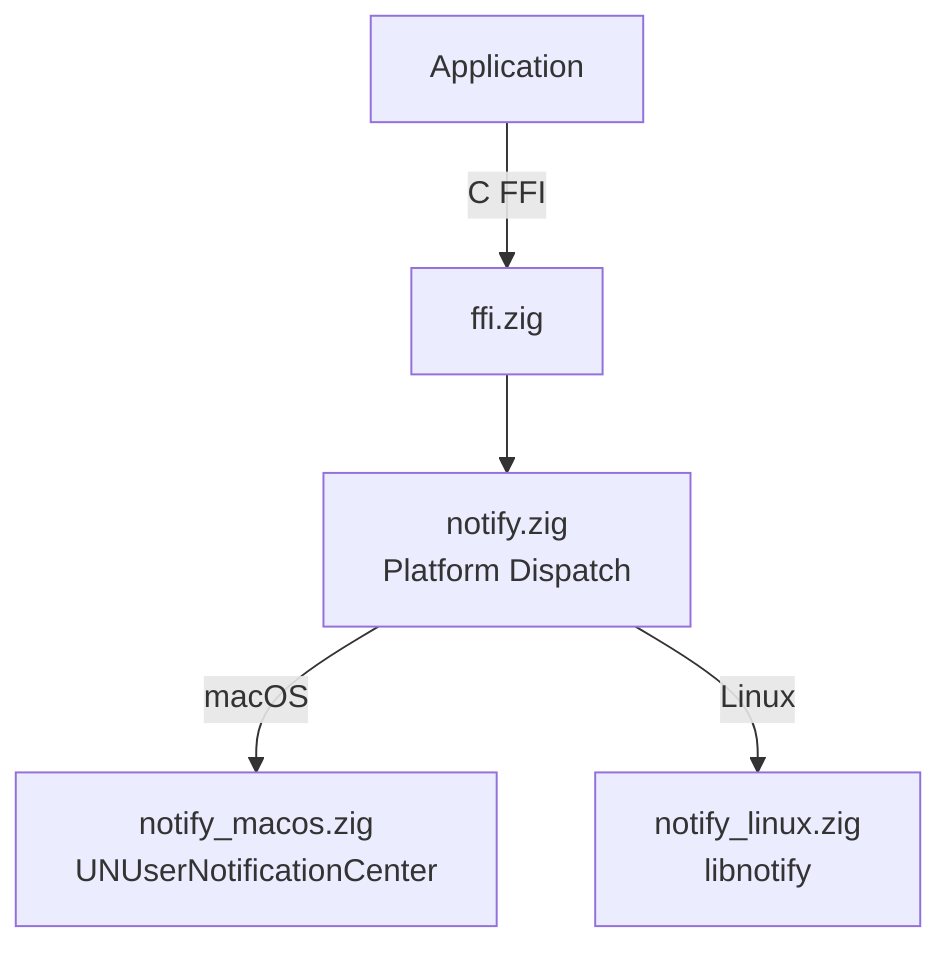

# zig-notify

Portable desktop notifications in Zig -- send notifications via macOS UNUserNotificationCenter and Linux libnotify, with a C FFI.

**License:** Zlib OR MIT

## Features

- **Send notifications**: Title, body, and urgency level
- **Permission handling**: macOS permission request (no-op on Linux)
- **Lifecycle management**: Init/deinit for Linux libnotify backend
- **Platform backends**: macOS (UNUserNotificationCenter), Linux (libnotify)
- **C FFI**: All operations exported for Swift, C, C++ interop

## Quick Start

```bash
# Build static library
zig build -Doptimize=ReleaseFast

# Run tests
zig build test
```

## Architecture



## Source Tree

```
zig-notify/
  build.zig            -- Build configuration
  include/
    zig_notify.h       -- C header (public API)
  src/
    ffi.zig            -- C FFI exports
    notify.zig         -- Platform dispatch
    notify_macos.zig   -- macOS notification backend
    notify_linux.zig   -- Linux libnotify backend
  tests/               -- Tests
```

## Requirements

- Zig 0.15.2+
- macOS 13+ or Linux with libnotify
