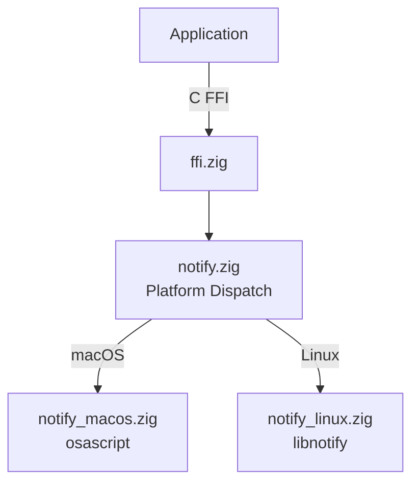

# zig-notify

Portable desktop notifications in Zig -- send notifications via macOS osascript and Linux libnotify, with a stable C FFI.

**License:** Zlib OR MIT

## Features

- **Send notifications**: Title, body, and urgency level
- **Permission handling**: no-op on current macOS osascript backend and Linux
- **Lifecycle management**: Init/deinit for Linux libnotify backend
- **Platform backends**: macOS (osascript), Linux (libnotify)
- **C FFI**: All operations exported for Swift, C, C++ interop
- **Zig package API**: Direct Zig imports use `src/root.zig`; C ABI exports stay in `src/ffi.zig`

## Quick Start

```bash
# Build static library
zig build -Doptimize=ReleaseFast

# Run tests
zig build test
```

## Architecture



## Source Tree

```
zig-notify/
  build.zig            -- Build configuration
  include/
    zig_notify.h       -- C header (public API)
  src/
    root.zig           -- Zig package API root
    ffi.zig            -- C FFI exports
    notify.zig         -- Platform dispatch
    notify_macos.zig   -- macOS notification backend
    notify_linux.zig   -- Linux libnotify backend
```

## Requirements

- Zig 0.15.2+
- macOS 13+ or Linux with libnotify

## Apple Interop Scope

zig-notify replaces only a simple local-notification call site: title/body send, basic lifecycle, and a portable C ABI. It does not replace SwiftUI, AppKit, UIKit, Cocoa, APNs, notification scheduling, notification actions, attachments, sounds, or `UNUserNotificationCenter` delegate behavior.

See [Apple Interop](guides/apple-interop.md) for Swift/Objective-C status and current parity gaps.
